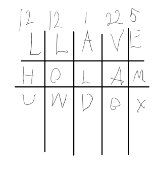
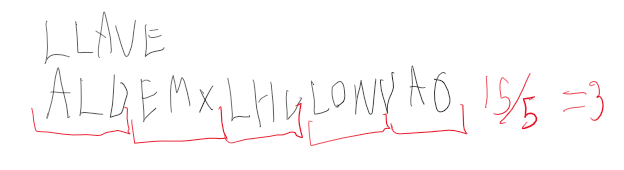
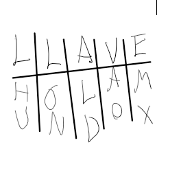

# Ejemplo Encriptacion/Desencriptacion con matriz
Programa de Encriptacion/Desencriptacion sencilla con la transposicion de una matriz 
## Encriptacion
  
Se tiene que ir __encriptado__ en una matriz segun una palabra clave y debes de tomar el orden del abecedario para ir anotando las letras de toda esa columna hasta completar el mensaje  
## Desencriptacion
Para __desencriptar__ segun la longitud del mensaje se divide entre la longitud de la palabra clave para tener la longitud de las columans de la matriz  
   
### Llenando la matriz
Al ya tener la longitud de las columnas(cuantas filas se tienen que hacer) se va lleando en el orden de la palabra, tambien hay que tener en cuenta si se llega a repetir una letra  

